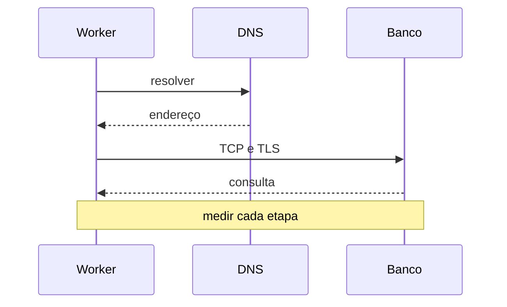

# Processos, Serviços e Rede

Um processo pode estar executando, dormindo, aguardando I/O, parado ou zumbi. O estado aponta a próxima pergunta, não a causa definitiva.

```bash
ps -eo pid,ppid,stat,wchan:24,%cpu,%mem,cmd --sort=-%cpu
systemctl status worker.service
journalctl -u worker.service --since '-15 min'
ss -s
ss -tnpi
```

Estado `D` representa espera ininterruptível, frequentemente I/O; muitos processos nessa condição elevam load. Zumbi já terminou e aguarda coleta pelo pai, consumindo PID, não CPU.

## Dependências

Separe tempo de DNS, conexão TCP, TLS, primeiro byte e corpo. Observe retransmissões, RTT, backlog, drops, erros e número de conexões. Uma fila na aplicação pode existir antes do socket.



systemd pode impor quotas, limites, restart e timeout. Contêineres acrescentam cgroups e namespaces; investigue no contexto correto. Compare arquivos abertos, threads, filas internas e limites com `systemctl show`, `/proc` e métricas da aplicação.

> [!note]
> Testar `localhost` não representa caminho, DNS, firewall ou latência do cliente real.

Revise [[04-Redes-e-Conectividade-no-Linux/README|Redes e Conectividade no Linux]] e avance para [[08-Profiling-Tracing-e-eBPF]].
