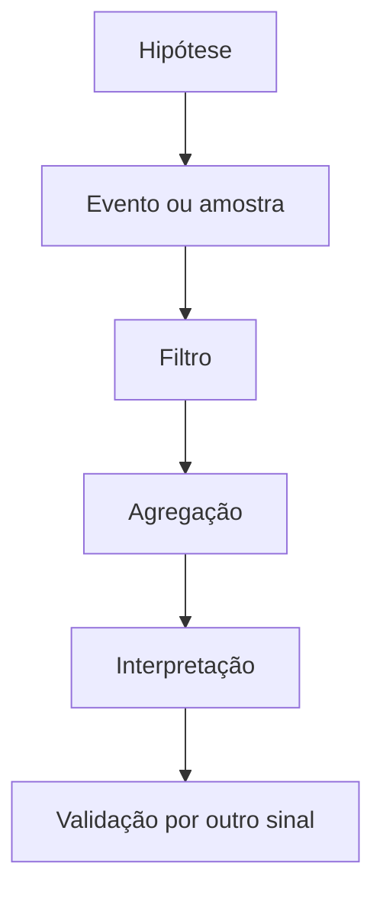

# Profiling, Tracing e eBPF

Profiling responde onde tempo ou recursos se concentram. Tracing registra eventos e relações ao longo do tempo. Ambos introduzem overhead e precisam de escopo, duração e interpretação.

## Escolha da técnica

| Técnica | Boa pergunta |
| --- | --- |
| sampling profiler | quais stacks consomem CPU? |
| syscall tracing | em quais syscalls o processo espera ou falha? |
| application tracing | qual etapa da requisição demora? |
| kernel tracing | onde ocorre latência no kernel? |
| eBPF | qual evento dinâmico pode ser agregado com baixo overhead? |

```bash
perf top -p "$PID"
perf record -F 99 -g -p "$PID" -- sleep 30
strace -f -tt -T -p "$PID"
bpftrace -e 'tracepoint:syscalls:sys_enter_openat { @[comm] = count(); }'
```

`strace` pode alterar timing e gerar muitos dados. `perf` depende de símbolos e permissões. eBPF executa programas verificados em hooks do kernel, mas não é magicamente gratuito nem sempre permitido.



Flame graphs representam frequência de stacks, não uma linha do tempo. Off-CPU profiling ajuda a descobrir locks e espera. Preserve privacidade: argumentos, caminhos e payloads podem conter segredos.

> [!tip]
> Comece pela ferramenta menos invasiva que pode refutar a hipótese e aumente a resolução gradualmente.

Próximo: [[09-Observabilidade-Incidentes-Capacidade-e-Tuning]].
