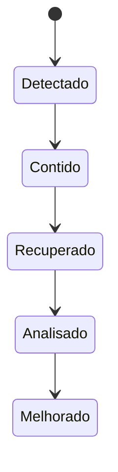

# Observabilidade, Incidentes, Capacidade e Tuning

Telemetria útil conecta experiência do usuário a serviço, processo e recurso. Coletar tudo sem modelo aumenta custo e dificulta encontrar o sinal relevante.

## Sinais e correlação

- métricas mostram tendência e agregação;
- logs registram eventos discretos com contexto;
- traces conectam etapas de uma operação;
- profiles revelam distribuição de trabalho;
- eventos de mudança explicam transições.

Use relógio sincronizado, identificadores de execução e versão. Alertas devem derivar de impacto ou risco acionável, possuir responsável e apontar runbook.

## Incidente

Durante o incidente, priorize segurança e serviço, mantenha linha do tempo, registre comandos e preserve evidências. O postmortem deve explicar condições sistêmicas, não procurar culpado.

## Capacidade e tuning

Modele demanda, sazonalidade, crescimento, redundância e tempo de provisionamento. Headroom protege picos e falhas. Para tuning:

1. declare objetivo e hipótese;
2. registre baseline e rollback;
3. mude uma variável em ambiente controlado;
4. aplique carga representativa;
5. meça efeito e efeitos colaterais;
6. documente ou reverta.

> [!warning]
> Parâmetros copiados de outra carga podem trocar throughput por latência, consumir memória ou reduzir segurança. Default só deve mudar diante de evidência.

Aplicação integrada: [[10-Estudo-de-Caso-DataRetail]].
