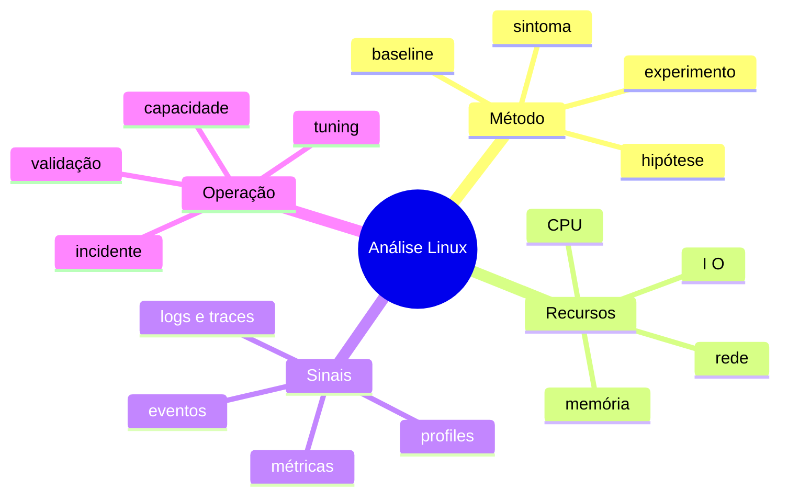

# Resumo

Diagnóstico confiável conecta impacto, serviço, dependência, processo e recurso por uma linha do tempo comum. USE cobre recursos; RED cobre serviços; profiling e tracing aprofundam uma hipótese já delimitada.

## Regras essenciais

1. Defina operação, carga, janela, expectativa e impacto.
2. Compare taxas e deltas, não contadores cumulativos isolados.
3. Procure saturação e erros, não apenas utilização.
4. Use percentis para latência e preserve dimensões relevantes.
5. Diferencie causa, consequência e correlação.
6. Escolha a ferramenta menos invasiva capaz de testar a hipótese.
7. Registre mudanças, rollback e resultado.
8. Transforme incidentes em melhorias de telemetria e capacidade.

Revise em [[12-Perguntas-de-Entrevista]] e [[13-Exercicios]].
