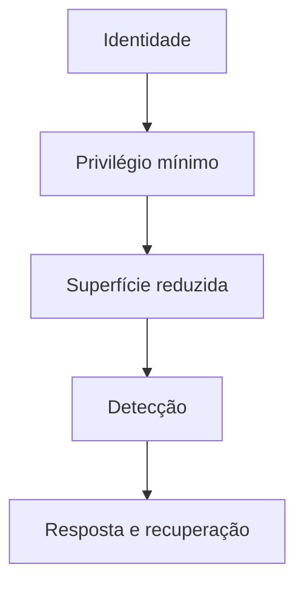

# Introdução

Segurança preserva confidencialidade, integridade, disponibilidade e rastreabilidade diante de ameaças. Hardening é uma parte desse sistema: remove funcionalidades desnecessárias, restringe privilégios e configura defaults seguros.

## Princípios

- menor privilégio e necessidade de saber;
- negação por padrão com permissões explícitas;
- defesa em profundidade;
- separação de funções;
- configuração como código e mudança revisável;
- monitoramento contínuo e recuperação testada.

Disponibilidade também é segurança. Uma regra que bloqueia administração ou atualização pode aumentar risco. Controles devem passar por teste, rollout gradual e rollback fora do canal alterado.

> [!warning]
> Compliance é evidência de requisitos em um momento; não prova ausência de vulnerabilidades nem substitui gestão de risco.

Comece em [[03-Ameacas-Risco-Baselines-e-Defesa-em-Profundidade]].
