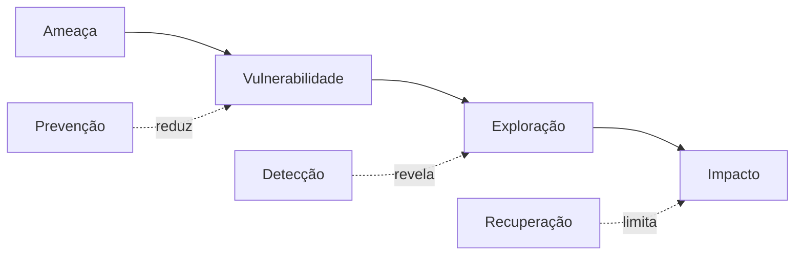

# Ameaças, Risco, Baselines e Defesa em Profundidade

Um modelo de ameaça identifica ativos, atores, fronteiras de confiança, caminhos de ataque e impacto. Risco combina probabilidade e consequência dentro de um contexto; pontuação genérica precisa ser ajustada à exposição e aos controles existentes.

## Construção do baseline

1. classifique o host e os dados;
2. inventarie serviços, usuários, pacotes, portas e dependências;
3. selecione referência como CIS ou guia do fornecedor;
4. adapte controles à função e ameaça;
5. teste disponibilidade e rollback;
6. registre exceções com prazo e compensação;
7. monitore drift.



```bash
systemd-analyze security
ss -lntup
findmnt --verify
systemctl list-unit-files --state=enabled
```

Defesa em profundidade deve evitar dependência de uma única barreira: identidade forte, segmentação, privilégios mínimos, isolamento, logs externos e backup imutável cobrem falhas diferentes.

> [!tip]
> Priorize controles que reduzem caminhos de ataque relevantes e têm alta verificabilidade, não apenas os mais fáceis de contar.

Próximo: [[04-Identidade-Autenticacao-PAM-Sudo-e-SSH]].
