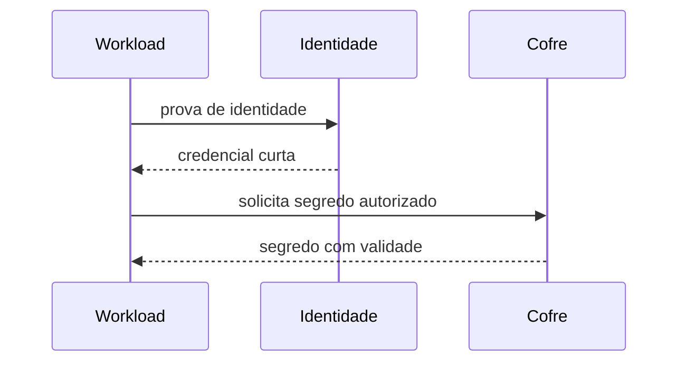

# Rede, Serviços, Criptografia e Segredos

Todo listener amplia superfície. Inventarie endereço, porta, processo, proprietário, protocolo, clientes e necessidade. Desabilite serviços não usados e limite binds, firewall e segmentação.

```bash
ss -lntup
systemctl --type=service --state=running
nft list ruleset
openssl s_client -connect host:443 -servername host </dev/null
```

## Criptografia

TLS protege confidencialidade, integridade e autenticação conforme validação de certificado. Controle versões, algoritmos, cadeia, hostname, revogação quando aplicável e expiração. Criptografia em repouso exige gestão de chaves separada do dado.

## Segredos

- não grave segredos em imagem, repositório, argumentos ou logs;
- entregue-os em runtime pelo mecanismo aprovado;
- limite leitura por identidade e tempo;
- rotacione, revogue e audite acesso;
- evite variável de ambiente quando ela puder vazar em dumps ou diagnóstico;
- trate backups e arquivos temporários como cópias sensíveis.



> [!tip]
> Rotação só é real quando consumidores aceitam a nova credencial e a antiga é revogada sem indisponibilidade.

Próximo: [[08-Atualizacoes-Integridade-Auditoria-e-Logs]].
