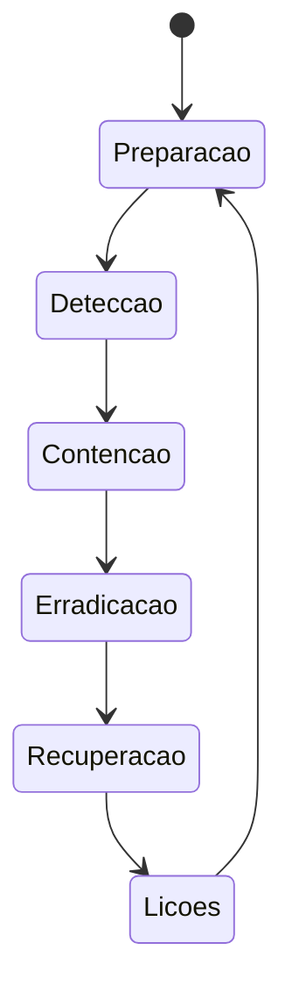

# Resposta a Incidentes, Compliance e Automação

Resposta a incidentes equilibra contenção, continuidade e preservação de evidências. O plano deve existir antes do evento e definir autoridade, comunicação e critérios de escalonamento.



## Princípios de resposta

- registre horário, operador e ação;
- preserve memória e estado volátil quando a estratégia exigir;
- não execute ferramentas não confiáveis no host comprometido;
- capture evidências com hash e cadeia de custódia;
- contenha por caminho controlado, evitando alertar atacante sem plano;
- restaure de fonte confiável e rotacione credenciais expostas;
- aumente monitoramento após recuperação.

## Compliance como código

Automação deve avaliar, não aplicar cegamente. Separe detecção de correção, gere resultado por controle, aceite exceção assinada e teste mudança em canário. Ferramentas como OpenSCAP, Lynis, osquery e gerenciadores de configuração ajudam, mas o baseline continua sendo decisão de risco.

```bash
auditctl -s
ausearch -m USER_AUTH --start today
systemd-analyze security serviço.service
```

> [!warning]
> Em suspeita de comprometimento, comandos locais podem estar adulterados e alterar timestamps. Siga o playbook forense e a orientação jurídica da organização.

Aplicação integrada: [[10-Estudo-de-Caso-DataRetail]].
