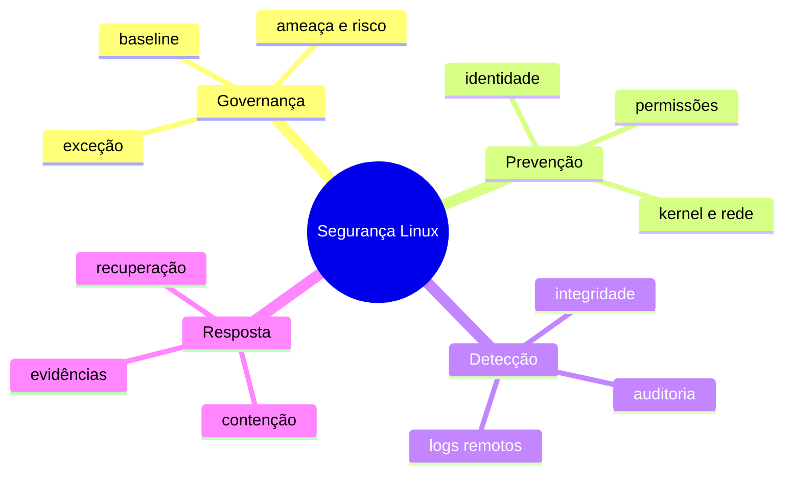

# Resumo

Hardening contextual reduz superfície, privilégio e tempo de exposição. Segurança completa também detecta abuso, contém impacto, recupera serviço e aprende com incidentes.

## Regras essenciais

1. Relacione cada controle a ameaça e ativo.
2. Use identidades individuais e privilégio mínimo.
3. Reduza listeners, pacotes, capabilities e mounts.
4. Proteja segredos durante criação, uso, rotação e descarte.
5. Teste patches, política e rollback em ondas.
6. Envie evidências para domínio protegido.
7. Monitore drift e prazo de exceções.
8. Prepare resposta e recuperação antes do incidente.

Revise em [[12-Perguntas-de-Entrevista]] e [[13-Exercicios]].
