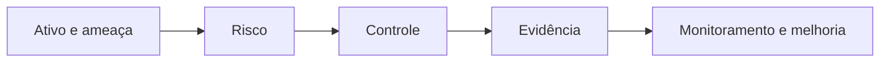

# Módulo 07 — Segurança e Hardening Linux

Hardening reduz superfície e impacto sem destruir a função do sistema. Cada controle deve responder a uma ameaça, possuir evidência, proprietário, exceção explícita e modo seguro de implantação.

## Percurso

1. [[01-Objetivos|Objetivos]]
2. [[02-Introducao|Introdução]]
3. [[03-Ameacas-Risco-Baselines-e-Defesa-em-Profundidade|Ameaças, Risco, Baselines e Defesa em Profundidade]]
4. [[04-Identidade-Autenticacao-PAM-Sudo-e-SSH|Identidade, Autenticação, PAM, Sudo e SSH]]
5. [[05-Permissoes-ACLs-Capabilities-e-Filesystems|Permissões, ACLs, Capabilities e Filesystems]]
6. [[06-Kernel-Sysctl-LSM-Seccomp-e-Modulos|Kernel, Sysctl, LSM, Seccomp e Módulos]]
7. [[07-Rede-Servicos-Criptografia-e-Segredos|Rede, Serviços, Criptografia e Segredos]]
8. [[08-Atualizacoes-Integridade-Auditoria-e-Logs|Atualizações, Integridade, Auditoria e Logs]]
9. [[09-Resposta-a-Incidentes-Compliance-e-Automacao|Resposta a Incidentes, Compliance e Automação]]
10. [[10-Estudo-de-Caso-DataRetail|Estudo de Caso — DataRetail S.A.]]
11. [[11-Resumo|Resumo]]
12. [[12-Perguntas-de-Entrevista|Perguntas de Entrevista]]
13. [[13-Exercicios|Exercícios]] e [[13-Gabarito|Gabarito]]
14. [[14-Laboratorio|Laboratório]] e [[14-Solucao|Solução]]
15. [[15-Referencias|Referências]]

