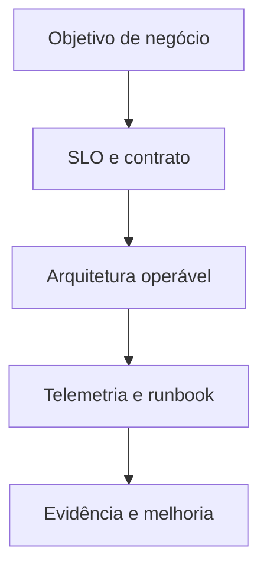

# Introdução

Uma plataforma de dados correta em condições ideais pode falhar em produção por disco cheio, certificado expirado, permissões, concorrência, mudança incompatível ou backup irrecuperável. Operabilidade precisa nascer no design.

## Dimensões

| Dimensão | Pergunta |
| --- | --- |
| serviço | qual capacidade e SLO entregamos? |
| estado | onde vivem dados, checkpoints e metadata? |
| dependência | o que ocorre quando banco, DNS ou storage falha? |
| mudança | como implantar, validar e reverter? |
| observação | como distinguir falha, atraso e degradação? |
| responsabilidade | quem decide e responde? |

> [!note]
> Alta disponibilidade reduz interrupções; disaster recovery restaura após desastre. Nenhum deles substitui backup nem teste de restauração.

Comece em [[03-Requisitos-SLOs-Topologia-e-Modelo-Operacional]].
