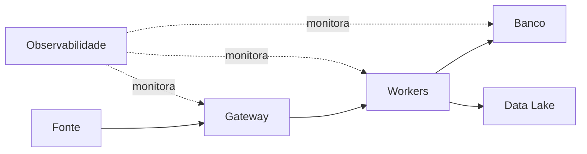

# Requisitos, SLOs, Topologia e Modelo Operacional

Requisitos operacionais devem ser mensuráveis: disponibilidade, atraso máximo, janela de processamento, RPO, RTO, retenção, throughput e segurança. “Sempre disponível” não orienta decisões.

## Topologia

Mapeie processos, hosts, volumes, redes, identidades, portas, fluxos, dependências e failure domains. Uma réplica no mesmo disco ou rack não cobre a falha compartilhada.

## SLO e orçamento de erro

SLI mede comportamento; SLO define alvo; SLA estabelece compromisso externo. O orçamento de erro equilibra confiabilidade e mudança, mas requer janela e população bem definidas.

O modelo operacional deve incluir owner, on-call, escalonamento, janela de manutenção, catálogo, runbook, mudança, acesso, backup e revisão de capacidade.

> [!tip]
> Registre dependência degradável, obrigatória ou assíncrona. Essa classificação orienta timeout, retry e fallback.

Próximo: [[04-Implantacao-Configuracao-e-Gestao-de-Servicos]].
