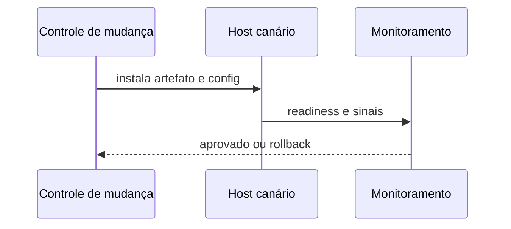

# Implantação, Configuração e Gestão de Serviços

Implantação segura promove o mesmo artefato identificado entre ambientes, separa configuração e segredo e valida saúde antes de ampliar exposição.

```ini
[Service]
User=dataretail
Group=dataretail
ExecStart=/opt/dataretail/releases/2026.07/worker
EnvironmentFile=/etc/dataretail/worker.env
Restart=on-failure
TimeoutStopSec=90
NoNewPrivileges=yes
PrivateTmp=yes
ProtectSystem=strict
ReadWritePaths=/var/lib/dataretail
```

Valide unidade com `systemd-analyze verify`, recarregue daemon, execute canário e confirme logs, métricas, dependências e rollback. `Restart=always` pode mascarar falha de configuração e criar loop.



Use usuário dedicado, diretórios previsíveis e permissões mínimas. Releases versionadas e um ponteiro atômico simplificam rollback, desde que schema e estado permaneçam compatíveis.

> [!warning]
> Rollback de binário não reverte automaticamente migração de dados. Planeje compatibilidade progressiva.

Continue em [[05-Estado-Armazenamento-Backup-e-Recuperacao]].
