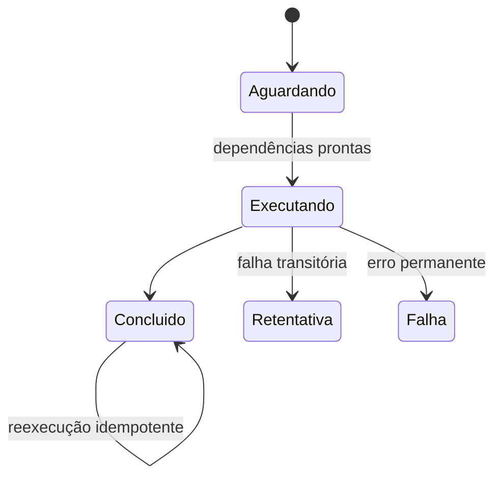

# Automação, Agendamento, Dependências e Idempotência

Uma agenda define quando tentar; não prova que entradas estão prontas nem que a execução anterior terminou. Modele dependências por condição observável e estado durável.

```bash
systemctl list-timers --all
systemctl show carga.service -p Result,ExecMainStatus
journalctl -u carga.service --since today
```

Rotinas precisam de timeout, lock, chave de idempotência, retry classificado, backoff, estado de conclusão e saída observável. Retente somente falhas transitórias e operações seguras.



Separe usuário do agendador, diretório, ambiente e limites. Cron oferece agenda simples; systemd timers integram dependências e journal; orquestradores de dados modelam DAG, backfill e lineage.

> [!tip]
> Backfill é uma operação de produção. Limite concorrência, priorize tráfego atual e acompanhe custo e qualidade.

Revise [[03-Shell-Script-e-Automacao/README|Shell Script e Automação]] e avance para [[07-Monitoramento-Saude-SLOs-e-Runbooks]].
