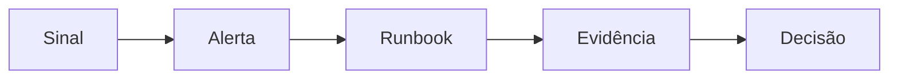

# Monitoramento, Saúde, SLOs e Runbooks

Saúde de processo não garante saúde dos dados. Uma plataforma precisa observar infraestrutura, serviço, pipeline e produto de dados.

| Camada | Exemplos de sinais |
| --- | --- |
| host | CPU, PSI, memória, disco, rede |
| serviço | taxa, erros, duração, fila |
| pipeline | último sucesso, atraso, registros, retries |
| dados | frescor, volume, schema, qualidade |
| negócio | pedidos disponíveis e reconciliação |

Health check deve testar a capacidade necessária sem sobrecarregar dependências. Alertas precisam ser acionáveis, deduplicados, roteados e vinculados a SLO.

Um runbook informa escopo, risco, pré-requisitos, checks somente leitura, ações, rollback, validação, escalonamento e referências. Deve ser exercitado, não apenas armazenado.

Use burn rate para alertar consumo rápido do orçamento de erro em múltiplas janelas. Monitore ausência de dados e o próprio pipeline de telemetria.

> [!note]
> Dashboard ajuda exploração; alerta convoca ação. Nem todo gráfico deve alertar.

Próximo: [[08-Incidentes-Continuidade-DR-e-Postmortems]].
