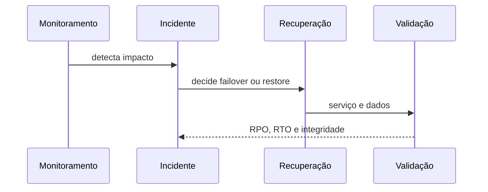

# Incidentes, Continuidade, DR e Postmortems

Incidente é desvio que ameaça serviço ou dados e exige coordenação. Defina comandante, comunicação, especialistas e registro da linha do tempo. Separe mitigação imediata de investigação profunda.

## Continuidade e DR

Análise de impacto identifica processos críticos, dependências, RPO e RTO. O plano deve cobrir perda de host, zona, identidade, storage, rede e equipe. Failover só é útil se dados, DNS, credenciais e capacidade estiverem prontos.

Exercícios de mesa validam decisões; testes técnicos validam execução. Registre tempo, lacuna, dependências e ações manuais.

Postmortem sem culpa descreve impacto, detecção, linha do tempo, fatores contribuintes, o que funcionou e ações com owner e prazo. “Erro humano” encerra investigação cedo demais.

> [!warning]
> Declare desastre apenas por autoridade definida. Failover precipitado pode criar split-brain ou perda adicional.

Continue em [[09-Capacidade-Mudancas-Custo-e-Melhoria-Continua]].
