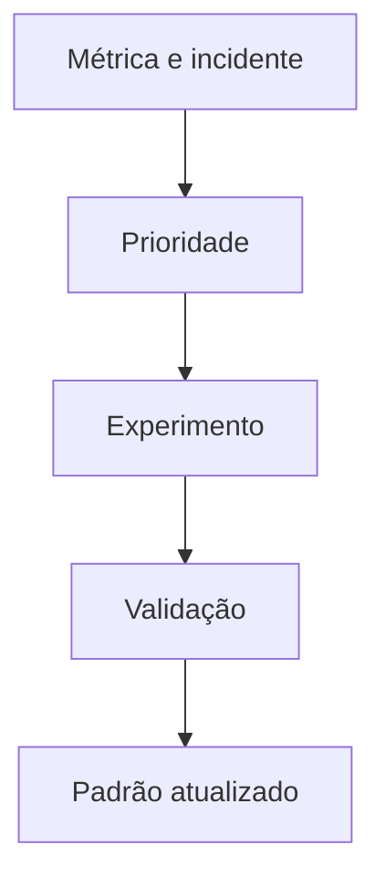

# Capacidade, Mudanças, Custo e Melhoria Contínua

Capacidade deve considerar crescimento de dados, throughput, concorrência, retenção, replicação, backfill, falha de nó e lead time de aquisição. Média mensal não representa pico diário.

```bash
sar -u -r -d -n DEV
systemd-cgtop
du -x --max-depth=1 /var/lib/dataretail
```

## Mudanças

Classifique risco, blast radius, reversibilidade e dependências. Mudanças pequenas, canário, feature flags e compatibilidade progressiva reduzem impacto. Toda mudança precisa de critérios objetivos de sucesso e aborto.

## Custo

Custo inclui compute, storage, rede, licença, observabilidade e trabalho operacional. Otimização não deve violar SLO, recuperação ou segurança. Meça custo por workload ou produto quando possível.



Revisões periódicas devem remover alertas inúteis, atualizar runbooks, testar restore, expirar acessos, revisar capacidade e reduzir toil por automação.

> [!tip]
> Automatize trabalho repetitivo e determinístico; preserve decisão humana onde contexto e risco dominam.

Aplicação integrada: [[10-Estudo-de-Caso-DataRetail]].
