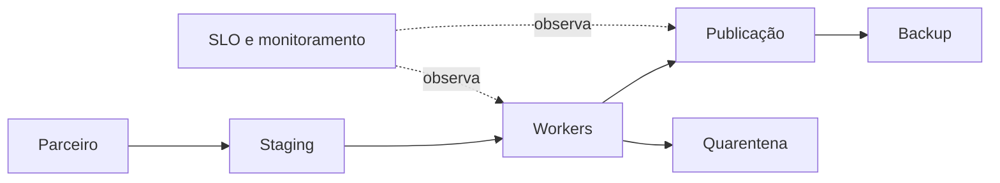

# Estudo de Caso — DataRetail S.A.

A DataRetail S.A. opera uma ingestão horária de pedidos. O objetivo é disponibilizar 99,5% dos lotes em até 30 minutos, com RPO de uma hora e RTO de duas horas.

## Design operacional

- dois workers em failure domains distintos;
- artefato versionado e configuração externa;
- identidade sem login e acesso mínimo ao storage;
- staging, publicação atômica e checkpoint idempotente;
- timer com lock e timeout;
- backup versionado e restore trimestral;
- alertas de atraso, erro, volume, disco e orçamento de erro;
- runbooks para fonte ausente, disco cheio e corrupção.

## Mudança e recuperação

Nova versão passa por canário com lote sintético, reconciliação e rollback. Em corrupção, a equipe interrompe publicação, preserva entrada, restaura último estado íntegro, reaplica lotes idempotentemente e valida contagens.

## Critérios de prontidão

Owner, SLO, identidade, limites, telemetria, backup, restore, runbook, rollback e capacidade devem estar aprovados antes da produção. O laboratório implementa essa gate em [[14-Laboratorio]].
