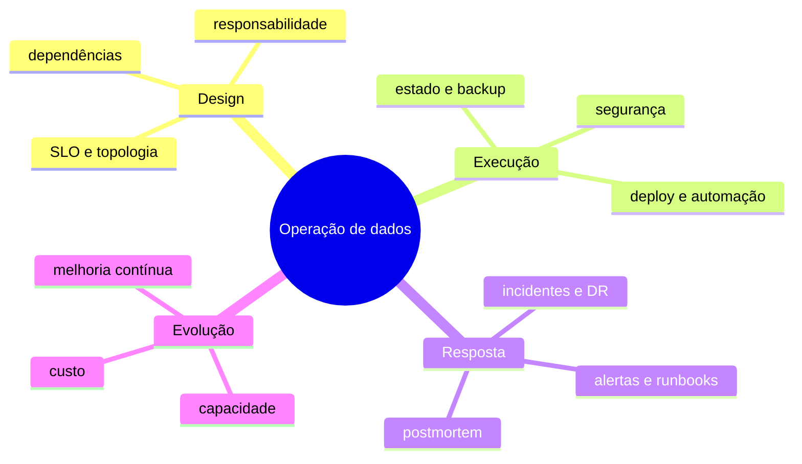

# Resumo

Operabilidade conecta design e produção. Serviços confiáveis possuem objetivos mensuráveis, estado classificado, mudanças reversíveis, telemetria acionável e recuperação exercitada.

## Regras essenciais

1. Defina SLO, RPO, RTO e owner antes da produção.
2. Promova artefato imutável e mantenha rollback compatível.
3. Classifique estado e teste restauração.
4. Automatize com lock, timeout, idempotência e evidência.
5. Observe host, serviço, pipeline, dados e negócio.
6. Vincule alertas a runbooks exercitados.
7. Planeje falhas compartilhadas e capacidade degradada.
8. Use incidentes e métricas para melhorar padrões.

Revise em [[12-Perguntas-de-Entrevista]] e [[13-Exercicios]].
