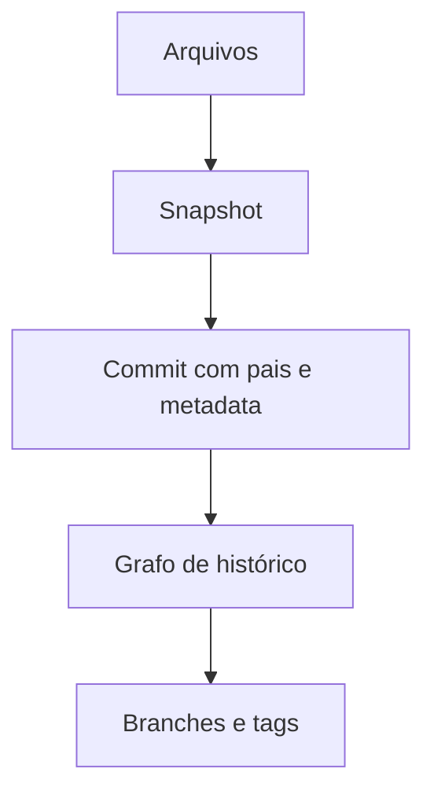

# Introdução

Projetos de dados mudam código, schemas, configuração, documentação e infraestrutura. Git preserva versões, autoria e relações entre mudanças, permitindo comparar, integrar, revisar e recuperar.

Git é distribuído: cada clone comum contém objetos e histórico, não apenas arquivos atuais. Operações locais são rápidas; colaboração ocorre ao trocar objetos e atualizar referências.

## O que Git não resolve sozinho

- autorização e revisão em plataforma remota;
- armazenamento eficiente de grandes datasets;
- segredos já publicados;
- qualidade sem testes e disciplina;
- semântica de migrações e compatibilidade de dados.

> [!warning]
> Git mantém versões. Remover um segredo do arquivo atual não o remove dos commits anteriores nem revoga cópias.

Comece em [[03-Versionamento-Distribuido-e-Estados-do-Git]].
