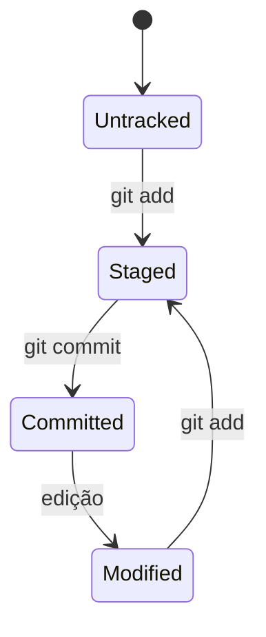

# Versionamento Distribuído e Estados do Git

Git armazena snapshots. Quando um arquivo não muda, o novo tree pode referenciar o mesmo blob, evitando duplicação lógica. O commit registra raiz do snapshot, pais, autor, committer e mensagem.

## Áreas

| Área | Papel |
| --- | --- |
| working tree | arquivos editáveis extraídos |
| index | snapshot proposto para o próximo commit |
| repositório local | objetos e refs em `.git` |
| remoto | outro repositório usado na colaboração |

```bash
git status --short
git diff
git diff --staged
git show HEAD
```

`git diff` compara working tree e index. `git diff --staged` compara index e HEAD. Um arquivo pode ter parte staged e parte não staged.

## Estados de acompanhamento

Arquivos podem ser untracked, tracked sem alteração, modified, staged ou ignorados. `.gitignore` afeta arquivos não rastreados; não remove um arquivo já versionado.



> [!tip]
> Antes de qualquer comando destrutivo, identifique qual área contém a única cópia da mudança.

Próximo: [[04-Objetos-Commits-Arvores-Refs-e-HEAD]].
