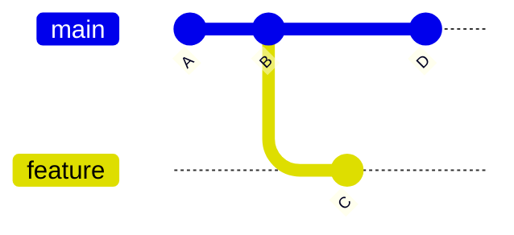

# Objetos, Commits, Árvores, Refs e HEAD

Objetos são identificados pelo hash do tipo, tamanho e conteúdo. O algoritmo depende do formato do repositório; historicamente SHA-1, com suporte moderno a SHA-256 em contextos específicos.

| Objeto | Conteúdo |
| --- | --- |
| blob | bytes de arquivo, sem nome |
| tree | nomes, modos e objetos filhos |
| commit | tree, pais, autores e mensagem |
| tag anotada | objeto-alvo, tagger e mensagem |

```bash
git cat-file -t HEAD
git cat-file -p HEAD
git ls-tree -r HEAD
git rev-parse HEAD^{tree}
```

Branches são refs móveis para commits. Tags normalmente marcam um commit estável. HEAD é referência simbólica à branch atual ou aponta diretamente a commit em *detached HEAD*.



Commits formam DAG por relações de pai. Merge possui dois ou mais pais. Identidade por hash detecta alteração, mas confiança em autoria requer assinatura e política externa.

> [!note]
> Arquivos vazios existem como blobs; diretórios vazios não são representados diretamente no tree.

Continue em [[05-Repositorio-Add-Commit-Diff-Log-e-Ignore]].
