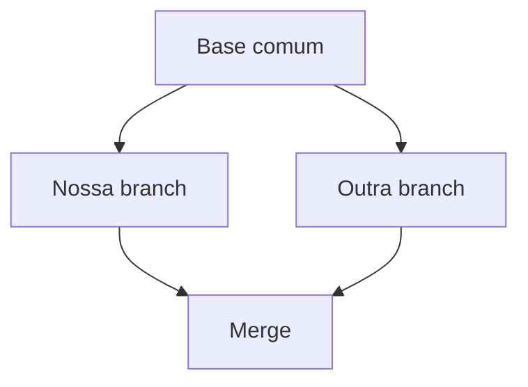

# Branches, Merges, Conflitos e Integração

Branch é uma referência móvel. Criar branch não copia arquivos; cria novo nome para um commit. Commits posteriores movem a branch atualmente apontada por HEAD.

```bash
git switch -c feature/qualidade
git switch main
git merge --no-ff feature/qualidade
```

Fast-forward apenas move a ref quando não há divergência. Merge de três vias cria commit com dois pais quando históricos divergem ou `--no-ff` é solicitado.

## Conflitos

Conflito ocorre quando Git não consegue combinar mudanças automaticamente. Ele não significa que alguém errou; exige decisão semântica.

```bash
git status
git diff --ours
git diff --theirs
git add arquivo-resolvido.sql
git merge --continue
```

Index mantém estágios base, ours e theirs durante conflito. Resolva o conteúdo, execute testes e revise o diff. `git merge --abort` tenta retornar ao estado anterior, mas mudanças locais prévias complicam recuperação.



Branches curtas reduzem divergência. Rebase reaplica commits e reescreve identidade; use em histórico privado conforme política, não em branch compartilhada sem coordenação.

> [!tip]
> Integre frequentemente e separe refatoração mecânica de mudança semântica para reduzir conflitos.

Continue em [[07-Remotos-Fetch-Pull-Push-e-Tracking]].
