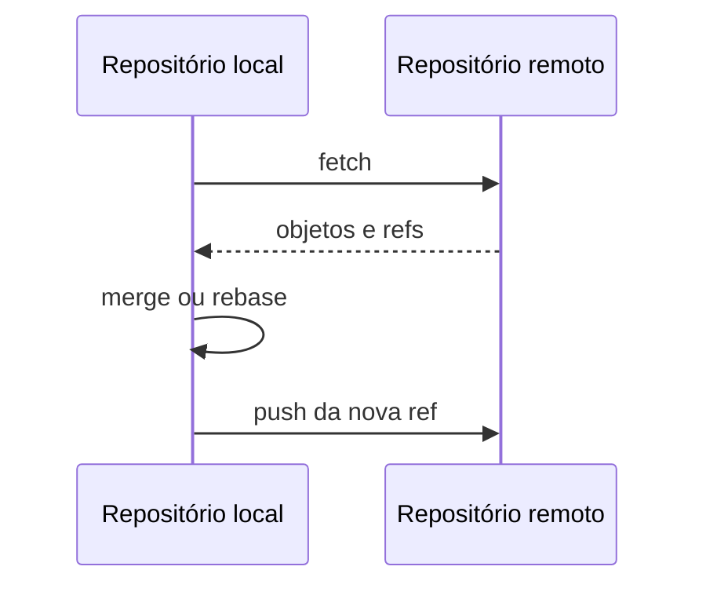

# Remotos, Fetch, Pull, Push e Tracking

Um remote é configuração com URLs e refspecs. `origin` é convenção, não servidor especial. Remote-tracking refs como `origin/main` são snapshots locais atualizados por fetch.

```bash
git remote -v
git fetch --prune origin
git log --left-right --graph main...origin/main
git branch -vv
```

`fetch` baixa objetos e atualiza refs remotas sem integrar working branch. `pull` combina fetch com merge ou rebase segundo configuração; explicitar a estratégia evita surpresa.

```bash
git pull --ff-only
git push -u origin feature/qualidade
```

Push solicita atualização de ref remota. O servidor pode rejeitar non-fast-forward, proteção ou falta de permissão. Nunca resolva automaticamente com force.

## Force com lease

`--force-with-lease` verifica expectativa sobre a ref antes de sobrescrever, sendo menos perigoso que `--force`, mas ainda reescreve histórico publicado. Use somente conforme workflow e comunicação.



Autenticação SSH ou HTTPS deve usar credenciais protegidas, escopo mínimo e rotação. Não inclua token na URL versionada.

Próximo: [[08-Desfazer-Recuperar-e-Reescrever-Historico]].
