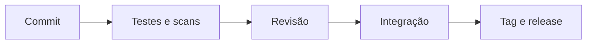

# Workflows, Qualidade, Segurança e Arquivos Grandes

Workflow define como branches nascem, são revisadas, testadas, integradas, lançadas e removidas. Trunk-based favorece branches curtas; GitFlow adiciona branches duradouras e custo de integração. Escolha conforme frequência, risco e capacidade de automação.

## Qualidade

- commits pequenos e semanticamente coesos;
- mensagens que expliquem intenção e impacto;
- revisão e CI antes de integrar;
- branch principal protegida;
- tags de release anotadas e, quando exigido, assinadas;
- hooks locais como conveniência, não única barreira.

```bash
git fsck --full
git tag -a v1.0.0 -m 'Release inicial'
git verify-commit HEAD
```

Assinatura atesta controle da chave no momento; confiança depende de identidade, proteção da chave e política.

## Segurança e dados

Use secret scanning e pre-commit, mas mantenha revisão. Não versione credenciais, dados pessoais, dumps, `.env` ou chaves. Para binários grandes, Git LFS armazena ponteiros e objetos separados; datasets devem preferir storage e catálogo próprios.



> [!note]
> Git registra linhas, não entende schema SQL ou notebook. Políticas e ferramentas especializadas complementam a revisão.

Aplicação: [[10-Estudo-de-Caso-DataRetail]].
