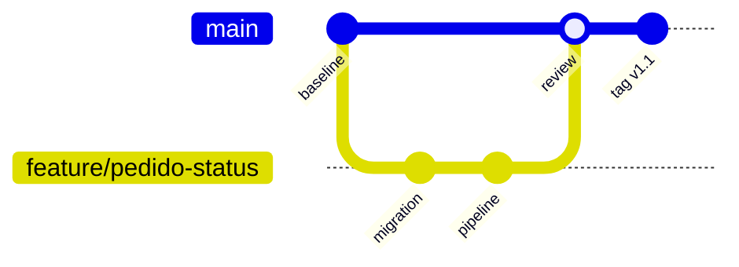

# Estudo de Caso — DataRetail S.A.

A DataRetail S.A. mantinha scripts SQL enviados por e-mail, sem versão implantada nem revisão. Uma alteração de coluna quebrou o pipeline e a equipe não conseguiu reconstruir o estado anterior.

## Novo fluxo

- repositório contém código, migrations, testes e documentação;
- dados, segredos e artefatos gerados permanecem fora;
- branches curtas partem de `main` atualizada;
- commits separam schema, código e documentação quando independentes;
- CI valida SQL, testes e secret scanning;
- merge exige revisão e histórico legível;
- release recebe tag e associa commit ao deploy.

## Incidente e recuperação

Uma regressão publicada foi revertida por novo commit, preservando auditoria. A migration foi desenhada com expand-contract, então a versão anterior continuou compatível. O reflog ajudou apenas em um commit local não publicado.

## Critérios

O commit implantado deve ser identificável, reproduzível e testado; rollback precisa considerar código e dados; nenhuma credencial pode existir no histórico. Pratique o fluxo em [[14-Laboratorio]].
