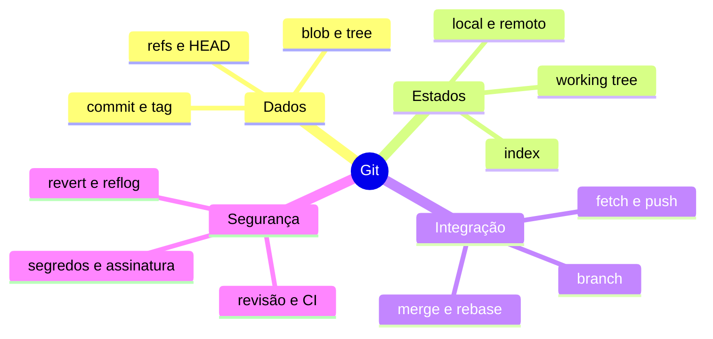

# Resumo

Git é um banco de objetos content-addressable cujo histórico forma um grafo. Comandos movem dados ou referências entre working tree, index, repositório local e remoto.

## Regras essenciais

1. Inspecione status e diff antes de alterar estados.
2. Construa commits coesos a partir do index.
3. Trate branch como ref móvel, não pasta copiada.
4. Use fetch para observar antes de integrar.
5. Resolva conflitos semanticamente e teste.
6. Prefira revert em histórico compartilhado.
7. Proteja credenciais e não versione datasets.
8. Relacione release e deploy ao commit exato.

Revise em [[12-Perguntas-de-Entrevista]] e [[13-Exercicios]].
