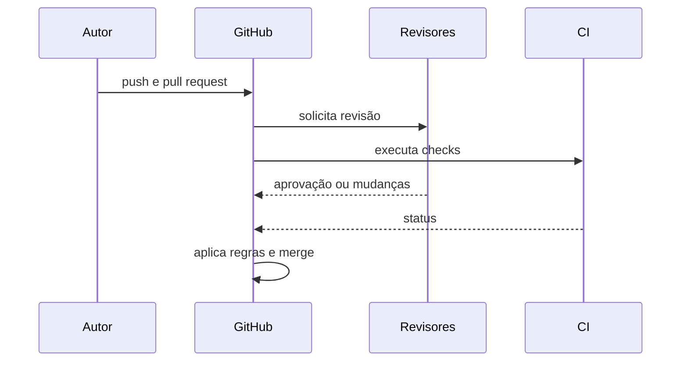

# Introdução

Um branch permite divergência temporária; uma pull request torna essa divergência discutível, testável e governável. A qualidade depende tanto do tamanho e contexto da mudança quanto das configurações da plataforma.

GitHub não substitui Git: pull request relaciona branches e eventos, mas commits continuam sendo objetos Git. Da mesma forma, uma aprovação não prova correção; ela registra uma decisão sob evidências disponíveis.

> [!warning]
> Bypass administrativo sem processo transforma proteção em recomendação. Exceções devem ser mínimas, auditadas e revisadas.

Comece em [[03-Modelos-de-Colaboracao-Permissoes-e-Forks]].
