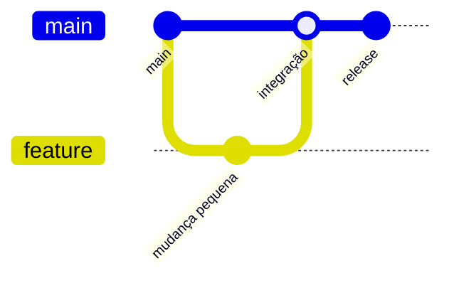

# Estratégias de Branches e Ciclo de Vida

Estratégia de branch controla tempo de divergência e custo de integração. Trunk-based usa branch principal estável e branches curtas; release branches sustentam versões paralelas; GitFlow adiciona branches duradouras e maior cerimônia.

## Critérios

- frequência de release e capacidade de CI;
- necessidade de versões suportadas em paralelo;
- risco de mudança de schema e dados;
- tamanho da equipe e dependências;
- regulamentação e aprovação.

Nome de branch deve comunicar objetivo sem carregar dado sensível. Exclua branches integradas para reduzir ruído, mas preserve commits pela branch principal ou tags.

Feature flags separam deploy de ativação, mas exigem owner e remoção. Branch por ambiente tende a causar drift; prefira mesmo artefato com configuração externa.

> [!note]
> Estratégia boa minimiza batch de mudança e tempo de feedback. O desenho mais complexo não é automaticamente mais seguro.

Continue em [[05-Pull-Requests-Revisao-e-Checks]].
