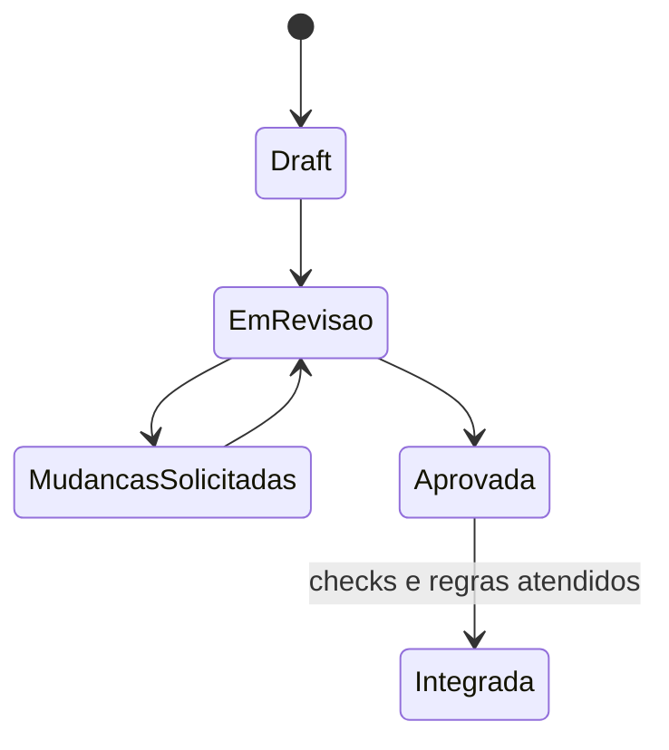

# Pull Requests, Revisão e Checks

Uma pull request deve explicar problema, solução, risco, teste, impacto em dados e rollback. Draft comunica trabalho ainda não pronto. Commits adicionais atualizam a mesma proposta.

## Revisão eficaz

Revise semântica, segurança, compatibilidade, observabilidade e manutenção. Diferencie bloqueio de sugestão. O autor responde, altera e resolve conversas somente após atender a intenção.

```text
## Contexto
## Mudança
## Impacto em schema e dados
## Testes e evidências
## Rollback
## Checklist de segurança
```

Checks podem validar lint, testes, build, scan e deploy de staging. Use nomes estáveis e proteja checks obrigatórios contra workflows que possam ser alterados para reportar sucesso falso.



> [!tip]
> PR pequena reduz carga cognitiva, conflito e tempo de ciclo. Separe refatoração, formatação e comportamento quando possível.

Próximo: [[06-Integracao-Conflitos-Rebase-Squash-e-Cherry-Pick]].
