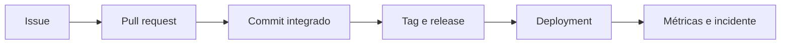

# Issues, Projetos, Releases e Rastreabilidade

Issue registra problema, resultado esperado, contexto e aceite. Pull request implementa mudança. Release comunica versão e artefatos. Deployment registra entrega a ambiente. A ligação entre eles cria rastreabilidade.

Templates melhoram consistência sem substituir julgamento. Labels precisam de taxonomia pequena e owner. Milestones agrupam objetivo temporal; Projects pode visualizar fluxo e campos.

Releases devem referenciar tag imutável, changelog, compatibilidade, migrations, checksums e rollback. Automatize notas com revisão humana quando mudança semântica importa.

Para dados, rastreie versão de schema, job, imagem e configuração implantada. Não coloque dados pessoais em issue pública ou logs de CI.

> [!tip]
> Fechar issue automaticamente é útil quando PR realmente entrega o critério de aceite; caso contrário, mantenha a relação sem fechamento prematuro.

Continue em [[09-Seguranca-Actions-Supply-Chain-e-Governanca]].
