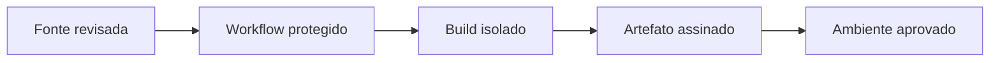

# Segurança, Actions, Supply Chain e Governança

Repositório é parte da cadeia de produção. Compromisso de conta, token, action ou regra pode alterar código e artefato confiável.

## Controles

- MFA e recuperação protegida;
- equipes e menor privilégio;
- branch principal e workflows protegidos;
- tokens curtos, permissões explícitas e OIDC para cloud;
- dependências e Actions fixadas por digest ou SHA completo;
- ambientes com aprovação e segredos separados;
- secret scanning, dependency review e code scanning;
- audit log, owners e plano de resposta.

```yaml
permissions:
  contents: read

jobs:
  test:
    runs-on: ubuntu-latest
    steps:
      - uses: actions/checkout@COMMIT_SHA_COMPLETO
      - run: ./tools/validate.sh
```

Código de PR não confiável não deve acessar segredos. Self-hosted runners precisam de isolamento, limpeza e controle de origem; podem reter credenciais ou ser pivot para a rede.



> [!warning]
> Tag de Action é mutável. A documentação oficial recomenda SHA completo para referência imutável, verificando que pertence ao repositório esperado.

Aplicação: [[10-Estudo-de-Caso-DataRetail]].
