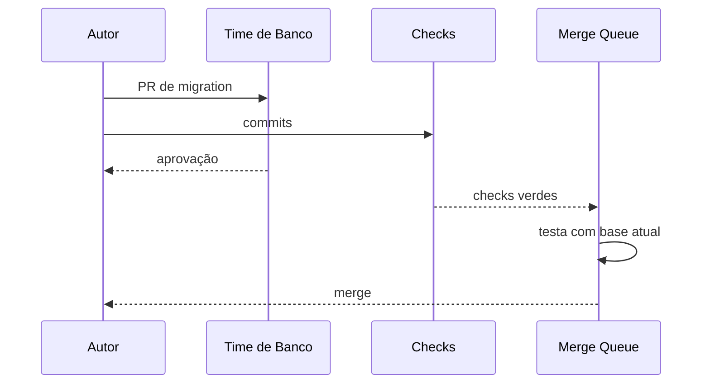

# Estudo de Caso — DataRetail S.A.

A DataRetail S.A. sofreu uma falha após merge direto de migration sem revisão. A branch principal aceitava force push, o CI tinha token amplo e não havia owner para SQL.

## Política adotada

- branches de feature curtas e PR obrigatória;
- duas aprovações para migrations e uma para demais mudanças;
- CODEOWNERS para SQL, infraestrutura e workflows;
- checks de testes, lint, compatibilidade e segredos;
- conversas resolvidas e aprovação invalidada por mudanças;
- force push e exclusão bloqueados;
- Actions com permissões mínimas e SHA completo;
- deploy de produção por ambiente protegido.

## Exceções

Hotfix segue PR pequena e revisão síncrona. Bypass emergencial exige incidente, dupla autorização e revisão posterior. O sistema preserva velocidade sem transformar urgência em acesso irrestrito.

## Aceite

Cada deploy liga issue, PR, commit, checks, aprovação, artefato e ambiente. O laboratório local em [[14-Laboratorio]] reproduz a colaboração sem depender de conta GitHub.
