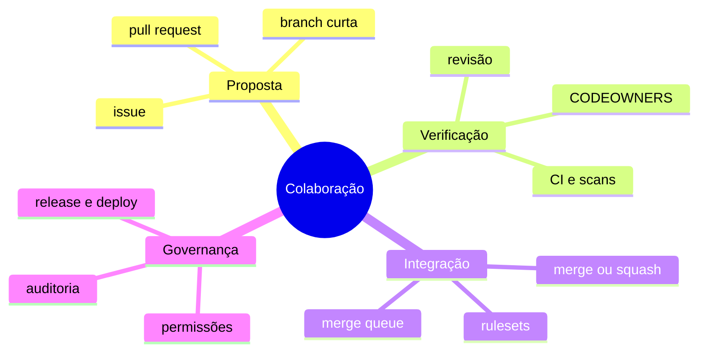

# Resumo

Colaboração eficaz reduz divergência, torna contexto visível e aplica política antes da integração. Branch, PR, revisão, check e ruleset têm responsabilidades diferentes.

## Regras essenciais

1. Use menor privilégio e equipes com owner.
2. Mantenha branches curtas e mudanças pequenas.
3. Explique impacto em dados, testes e rollback.
4. Proteja branch, workflows e CODEOWNERS.
5. Exija checks estáveis e revisões relevantes.
6. Trate código de fork como não confiável.
7. Fixe Actions por SHA completo e limite tokens.
8. Ligue issue, PR, commit, release e deploy.

Revise em [[12-Perguntas-de-Entrevista]] e [[13-Exercicios]].
