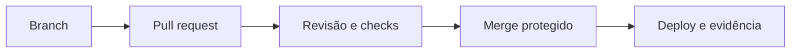

# Módulo 02 — Branches, Colaboração e GitHub

Colaboração segura transforma mudanças locais em decisões revisadas, testadas e rastreáveis. Git fornece o grafo; GitHub acrescenta identidade, permissões, pull requests, regras, automação e auditoria.

## Percurso

1. [[01-Objetivos|Objetivos]]
2. [[02-Introducao|Introdução]]
3. [[03-Modelos-de-Colaboracao-Permissoes-e-Forks|Modelos de Colaboração, Permissões e Forks]]
4. [[04-Estrategias-de-Branches-e-Ciclo-de-Vida|Estratégias de Branches e Ciclo de Vida]]
5. [[05-Pull-Requests-Revisao-e-Checks|Pull Requests, Revisão e Checks]]
6. [[06-Integracao-Conflitos-Rebase-Squash-e-Cherry-Pick|Integração, Conflitos, Rebase, Squash e Cherry-pick]]
7. [[07-Protecoes-Rulesets-CODEOWNERS-e-Merge-Queue|Proteções, Rulesets, CODEOWNERS e Merge Queue]]
8. [[08-Issues-Projetos-Releases-e-Rastreabilidade|Issues, Projetos, Releases e Rastreabilidade]]
9. [[09-Seguranca-Actions-Supply-Chain-e-Governanca|Segurança, Actions, Supply Chain e Governança]]
10. [[10-Estudo-de-Caso-DataRetail|Estudo de Caso — DataRetail S.A.]]
11. [[11-Resumo|Resumo]]
12. [[12-Perguntas-de-Entrevista|Perguntas de Entrevista]]
13. [[13-Exercicios|Exercícios]] e [[13-Gabarito|Gabarito]]
14. [[14-Laboratorio|Laboratório]] e [[14-Solucao|Solução]]
15. [[15-Referencias|Referências]]

