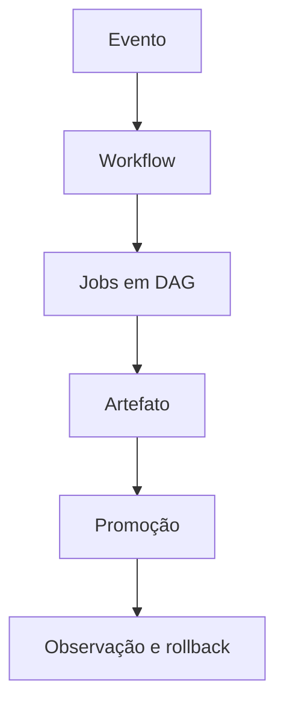

# Introdução

Integração contínua reduz o intervalo entre mudança e feedback. Entrega contínua mantém artefato implantável; implantação contínua promove automaticamente conforme política. São capacidades diferentes.

Workflow é código privilegiado: pode ler fonte, gerar artefatos e acessar ambientes. Revisão, pinning, permissões mínimas e isolamento são requisitos de segurança.

> [!warning]
> Automação rápida de um processo inseguro amplia o impacto. Desenhe confiança e recuperação antes de aumentar frequência.

Comece em [[03-Workflows-Eventos-Filtros-Contextos-e-Expressoes]].
