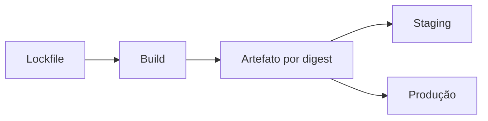

# Dependências, Cache, Artefatos e Reprodutibilidade

Cache acelera dependências regeneráveis; artefato preserva saída de uma execução ou transfere dados entre jobs. Cache não deve ser requisito de correção e deve ser tratado como entrada não confiável.

```yaml
- uses: actions/cache@COMMIT_SHA_COMPLETO
  with:
    path: ~/.cache/pip
    key: pip-${{ runner.os }}-${{ hashFiles('requirements.lock') }}
```

O build deve fixar dependências, normalizar metadata quando necessário e produzir checksum, SBOM e proveniência. Gere uma vez e promova o mesmo digest; não reconstrua por ambiente.

Artefatos precisam de retenção, nome, integridade e restrição de dados sensíveis. Outputs são adequados a valores pequenos, não binários.



> [!warning]
> Cache poisoning pode levar código não confiável a execuções privilegiadas. Separe escopos e nunca armazene segredos.

Próximo: [[06-Permissoes-Segredos-OIDC-e-Ambientes]].
