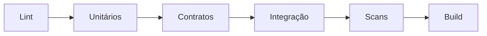

# Integração Contínua, Testes, Qualidade e Feedback

CI deve detectar regressão cedo e de forma determinística. Organize feedback do barato para o caro: sintaxe, lint, unitário, contrato, integração, segurança e end-to-end.

Use nomes estáveis para required checks, timeout, cancelamento de runs obsoletas e relatórios de falha. Flaky test deve ser tratado como defeito; retry indiscriminado reduz confiança.

Para dados, valide SQL, migrations, schema, qualidade de fixtures, idempotência e compatibilidade. Dados de teste devem ser sintéticos ou protegidos.

> [!tip]
> Meça tempo até feedback, taxa de falha, flakiness e causas. CI lento incentiva batches grandes e bypass.

Próximo: [[08-Entrega-Deploy-Concurrency-Aprovacoes-e-Rollback]].
