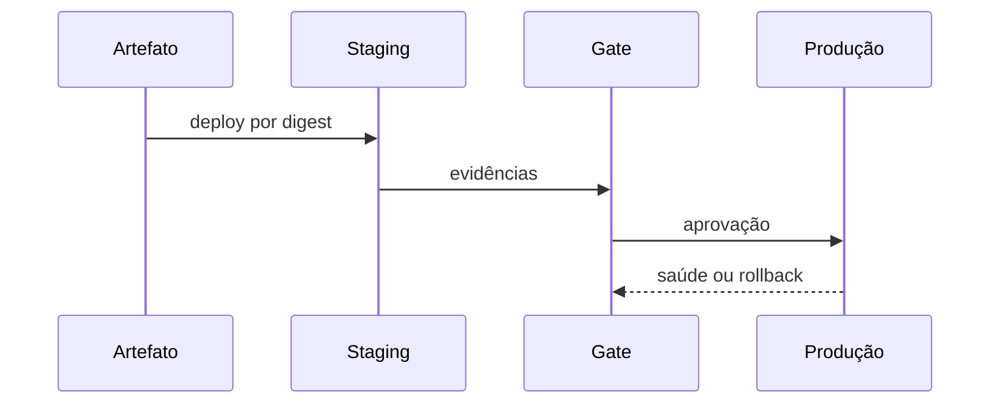

# Entrega, Deploy, Concurrency, Aprovações e Rollback

Entrega promove artefato verificado, não recompila fonte. Ambientes definem identidade, política e evidência. Staging reduz risco, mas não prova produção idêntica.

```yaml
concurrency:
  group: production
  cancel-in-progress: false

jobs:
  deploy:
    environment: production
    needs: build
```

Concurrency impede sobreposição por grupo. Cancelar run antiga é útil em CI, mas pode ser perigoso no meio de deploy ou migration. Ordenação de grupos não deve ser tratada como fila de negócio garantida.

Canário, blue-green e rolling possuem trade-offs. Rollback deve considerar schema, mensagens e estado; expand-contract preserva compatibilidade.



> [!note]
> Separe aprovação do código e aprovação do deployment quando riscos e responsabilidades diferem.

Continue em [[09-Reuso-Observabilidade-Supply-Chain-e-Governanca]].
