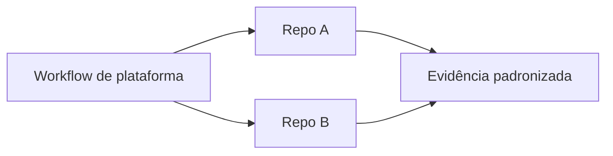

# Reuso, Observabilidade, Supply Chain e Governança

Reusable workflow reutiliza jobs e políticas; composite action reutiliza steps dentro de job. Interfaces precisam de inputs tipados, outputs, segredos explícitos e versionamento.

Fixe actions externas por SHA completo, limite actions permitidas e revise atualização. Gere SBOM, atestação e assinatura do artefato quando o risco exigir.

Observe duração, fila, custo, falhas por etapa, cache hit, deploys e rollback. Retenha logs conforme auditoria, sem segredos. Workflow deve apontar commit, artefato e ambiente.

Governança define owners de workflows, política de runners, permissões, exceções, orçamento e depreciação. Reuso centralizado não deve virar gargalo; compatibilidade e changelog importam.

> [!tip]
> Use dependency graph de reusable workflows para avaliar impacto de mudança e planejar migração.

Aplicação: [[10-Estudo-de-Caso-DataRetail]].
