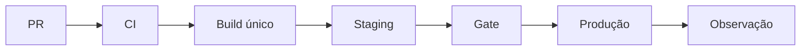

# Estudo de Caso — DataRetail S.A.

A DataRetail S.A. reconstruiu artefatos em cada ambiente e guardava chave cloud como secret de repositório. Releases diferentes recebiam o mesmo nome e rollback não era testado.

## Novo pipeline

- PR executa lint, unitários, contratos, integração e scans;
- merge em `main` gera um artefato por digest, SBOM e atestação;
- staging recebe esse digest e executa smoke e reconciliação;
- produção usa environment, aprovação, OIDC e concurrency;
- deploy registra commit, digest, migration e métricas;
- rollback usa artefato anterior e schema compatível.

Workflows externos são fixados por SHA; tokens têm escopo por job; código de fork não recebe segredo. O laboratório em [[14-Laboratorio]] valida a política estrutural desse DAG.
