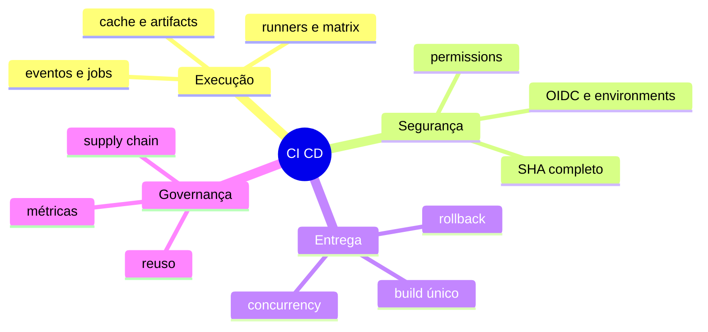

# Resumo

Workflow confiável transforma evento em DAG, evidência, artefato imutável e promoção protegida.

Regras: permissões mínimas; código externo não confiável; cache regenerável; artefato por digest; OIDC; ambientes protegidos; migrations compatíveis; workflows reutilizáveis versionados; observabilidade e rollback.

Revise em [[12-Perguntas-de-Entrevista]] e [[13-Exercicios]].
