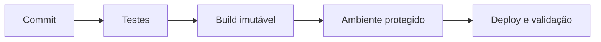

# Módulo 03 — GitHub Actions e CI/CD

CI/CD transforma cada mudança em evidência automatizada e promove o mesmo artefato por ambientes. Velocidade sustentável depende de reprodutibilidade, identidade mínima, gates e rollback.

## Percurso

1. [[01-Objetivos|Objetivos]]
2. [[02-Introducao|Introdução]]
3. [[03-Workflows-Eventos-Filtros-Contextos-e-Expressoes|Workflows, Eventos, Filtros, Contextos e Expressões]]
4. [[04-Jobs-Steps-Runners-Matrizes-e-Servicos|Jobs, Steps, Runners, Matrizes e Serviços]]
5. [[05-Dependencias-Cache-Artefatos-e-Reprodutibilidade|Dependências, Cache, Artefatos e Reprodutibilidade]]
6. [[06-Permissoes-Segredos-OIDC-e-Ambientes|Permissões, Segredos, OIDC e Ambientes]]
7. [[07-Integracao-Continua-Testes-Qualidade-e-Feedback|Integração Contínua, Testes, Qualidade e Feedback]]
8. [[08-Entrega-Deploy-Concurrency-Aprovacoes-e-Rollback|Entrega, Deploy, Concurrency, Aprovações e Rollback]]
9. [[09-Reuso-Observabilidade-Supply-Chain-e-Governanca|Reuso, Observabilidade, Supply Chain e Governança]]
10. [[10-Estudo-de-Caso-DataRetail|Estudo de Caso — DataRetail S.A.]]
11. [[11-Resumo|Resumo]]
12. [[12-Perguntas-de-Entrevista|Perguntas de Entrevista]]
13. [[13-Exercicios|Exercícios]] e [[13-Gabarito|Gabarito]]
14. [[14-Laboratorio|Laboratório]] e [[14-Solucao|Solução]]
15. [[15-Referencias|Referências]]

