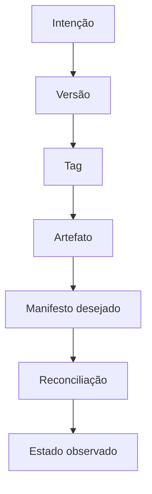

# Introdução

Código aprovado ainda não é uma entrega. Consumidores precisam saber **o que** mudou, **qual** unidade instalar e **quais** garantias acompanham essa unidade. Operadores precisam saber **qual estado** deveria estar ativo e se o ambiente converge para ele.

Uma release associa identidade, conteúdo, documentação e evidências. GitOps mantém a configuração desejada declarativa e versionada, enquanto agentes comparam continuamente o desejado ao observado.

> [!warning]
> GitOps não é executar `git pull` no servidor. A propriedade central é a reconciliação automática e contínua por um agente com escopo controlado.

O módulo começa pela semântica de compatibilidade, passa pela unidade de entrega e termina no controle operacional.
