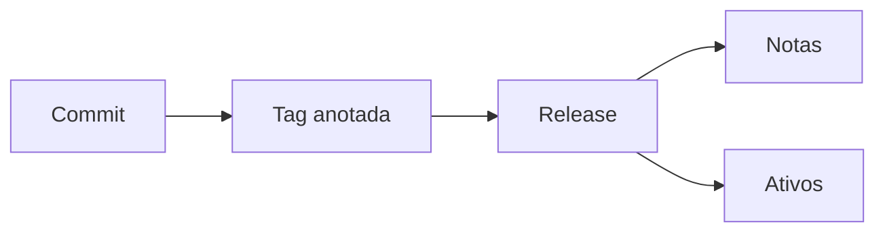

# Tags, Releases, Changelog e Notas

Uma tag aponta para um objeto Git; uma release agrega essa referência a notas, ativos e metadados de publicação. Tags anotadas são objetos com autor, data e mensagem e podem ser assinadas. Tags leves são apenas referências.

```bash
git tag -s v1.4.0 -m "DataRetail API v1.4.0"
git tag -v v1.4.0
git push origin v1.4.0
```



O changelog é curado para humanos e permanece no repositório. Release notes descrevem uma publicação específica. Commits convencionais podem apoiar automação, mas não substituem análise de impacto.

Boas notas respondem: o que mudou, quem é afetado, como migrar, como validar e como reverter. Uma release publicada deve ser imutável; correções geram uma nova versão.

> [!tip]
> Gere o rascunho automaticamente, mas exija revisão humana para incompatibilidades, migrações e riscos operacionais.

Excluir e recriar uma tag publicada destrói rastreabilidade. O capítulo seguinte protege também os bytes entregues.
