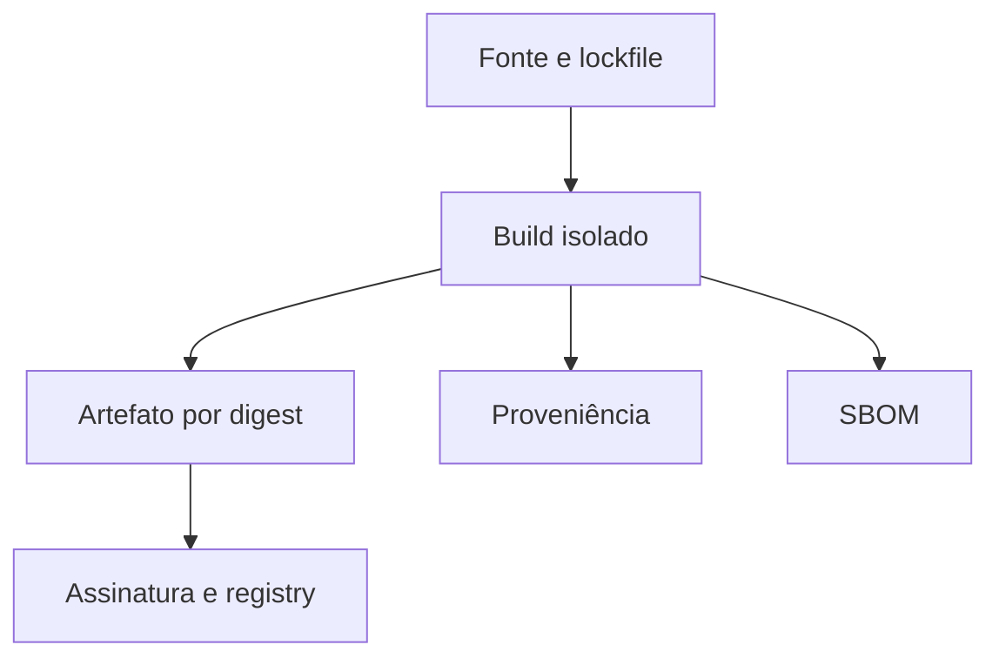

# Artefatos, Imutabilidade, Proveniência e SBOM

O pipeline deve construir uma vez e promover o mesmo artefato. Reconstruir por ambiente permite divergência de dependências, ferramentas e tempo.

Um digest identifica conteúdo; assinatura associa uma identidade; proveniência descreve origem e processo; SBOM enumera componentes. São controles complementares.

```bash
sha256sum dist/dataretail-api-1.4.0.tar.gz
sha256sum --check SHA256SUMS
```



Reprodutibilidade reduz ambiguidades, embora builds bit a bit exijam controlar timestamps, ordem, locale e toolchain. Retenção deve abranger artefato, digest, evidências e metadados de implantação.

> [!warning]
> Uma tag de imagem mutável, como `latest`, não é uma identidade suficiente para promoção ou rollback.

O consumidor deve verificar políticas antes do deploy: origem autorizada, assinatura válida, digest esperado e vulnerabilidades dentro do risco aceito.
