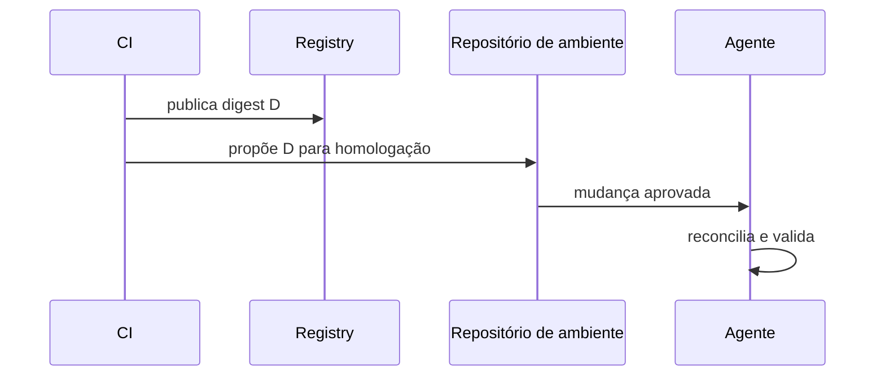

# Estratégias de Release, Promoção e Rollback

Release é disponibilidade de uma versão; deploy altera um ambiente; ativação expõe comportamento. Separar esses eventos reduz o raio de impacto.

| Estratégia | Mecanismo | Principal trade-off |
| --- | --- | --- |
| rolling | substituição gradual | versões coexistem |
| blue-green | troca de ambiente | custo duplicado |
| canary | tráfego progressivo | exige métricas confiáveis |
| feature flag | ativação lógica | dívida de flags |

Rollback restaura uma declaração anterior; roll-forward publica uma correção. Bancos e dados tornam reversão difícil: prefira mudanças expand-contract, backups testados e compatibilidade entre versões adjacentes.

Promoção deve mover referência ao mesmo digest, com gates específicos por ambiente. Copiar ou recompilar artefatos quebra a cadeia de custódia.
