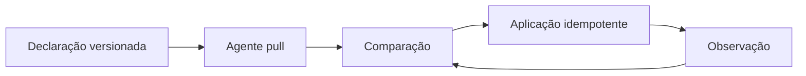

# Fundamentos e Arquitetura GitOps

OpenGitOps define quatro propriedades: estado desejado declarativo; versionado e imutável; obtido automaticamente por agentes; continuamente reconciliado.

No modelo pull, o controlador dentro ou próximo do ambiente busca declarações. Isso evita entregar credenciais amplas do ambiente ao sistema de CI. O agente ainda precisa de autenticação, autorização mínima e validação de origem.

O repositório de aplicação registra código e build; o de ambiente registra a versão promovida e configuração não secreta. Separá-los pode melhorar permissões e histórico, mas aumenta coordenação.

> [!note]
> Git é a fonte autoritativa da intenção, não necessariamente de todo dado operacional. Métricas, eventos e segredos não devem ser forçados ao mesmo modelo.

GitOps aplica-se além de Kubernetes sempre que houver configuração declarativa, uma API idempotente e um reconciliador confiável.
