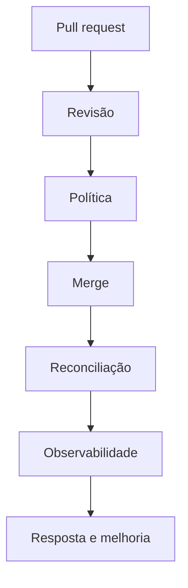

# Governança, Métricas, Segurança e Adoção

O pull request torna intenção revisável, mas não basta sozinho. Rulesets, CODEOWNERS, commits assinados, políticas como código e separação de funções formam o controle preventivo; logs e métricas formam o controle detectivo.

Métricas úteis incluem tempo de reconciliação, idade do drift, taxa de sucesso, frequência de deploy, lead time, falha de mudança e tempo de restauração. Uma métrica sem decisão associada vira telemetria decorativa.

Adoção segura começa por um ambiente de baixo risco, poucos recursos e runbook claro. Depois amplia escopo, automatiza promoção e mede resultados.

Antipadrões: conceder privilégios administrativos ao agente, misturar build e reconciliação, aceitar alterações manuais permanentes, armazenar segredos claros e automatizar sem SLO.

> [!tip]
> Defina break-glass antes da emergência: quem autoriza, por quanto tempo, como auditar e como devolver a mudança ao fluxo declarativo.
