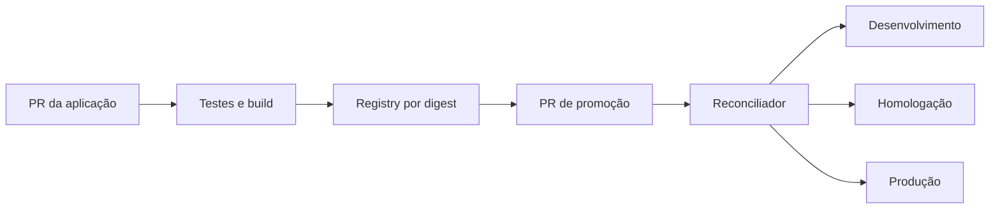

# Estudo de Caso — DataRetail S.A.

A DataRetail S.A. recompilava o serviço de ingestão em cada ambiente e mantinha configurações por comandos manuais. Homologação e produção frequentemente executavam bytes diferentes sob a mesma etiqueta.

## Decisão

O time declarou a API de eventos, adotou SemVer e passou a produzir uma imagem única por digest. A release contém tag assinada, changelog, SBOM e proveniência. Um repositório separado registra o digest promovido por ambiente.

Produção exige duas aprovações e política de assinatura. Canary recebe 5% do tráfego e avança apenas com SLOs saudáveis. Rollback altera o manifesto para o digest anterior; migrações usam expand-contract.

## Resultado

O time passou a responder precisamente qual commit, artefato e declaração estavam ativos. Drift manual tornou-se evento mensurável, e o tempo de restauração caiu porque o rollback deixou de depender de reconstrução.

O aprendizado central foi separar **produção do artefato** de **reconciliação do ambiente**.
